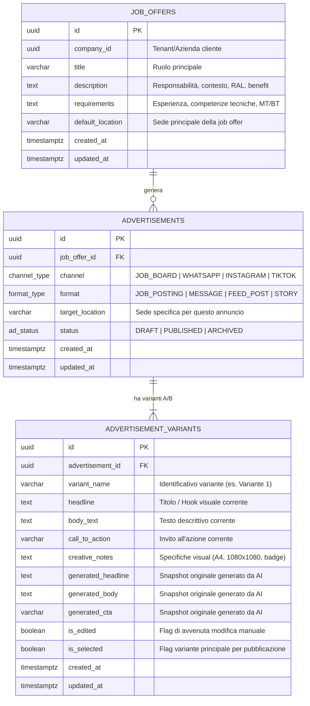
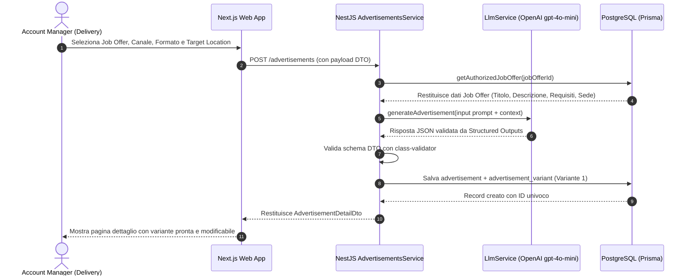

# Architettura del Sistema — Sezione Annunci

Questo documento illustra la struttura del progetto, la modellazione del dominio, il flusso dei dati e le scelte architetturali adottate per la sezione Annunci di Gyver.

---

## 1. Struttura del Progetto e Motivazioni

Il progetto è impostato come un **monorepo TypeScript end-to-end**:

```
gyver/
├── apps/
│   ├── api/                 # Backend NestJS (REST API, orchestrazione LLM, persistenza Prisma)
│   └── web/                 # Frontend Next.js 15 (App Router, Tailwind CSS, UI Delivery team)
├── docs/
│   └── migrations/          # Schema DDL PostgreSQL e seed SQL ufficiali
├── architecture.md          # Documento di architettura e modellazione dati
├── prompts.md               # Prompt design, evoluzione e vincoli strutturati
├── ai-workflows.md          # Flussi e tooling di sviluppo AI
├── tradeoffs.md             # Decisioni di tradeoff, compromessi e priorità future
└── readme.md                # Quickstart, installazione e guida all'uso
```

### Perché questa divisione:
* **Separazione delle responsabilità:** il backend isola le regole di business, la validazione dei dati e la complessità di integrazione con i provider AI; il frontend è una SPA/SSR leggera pensata per la massima rapidità d'uso da parte dell'Account Manager di Gyver.
* **Type Safety condivisa:** l'uso di TypeScript su entrambi i lati assicura allineamento sui contratti di interfaccia (`channel_type`, `format_type`, DTO di input/output).
* **Affidabilità d'esecuzione:** NestJS fornisce Dependency Injection nativa, gestione unificata delle eccezioni HTTP e pipeline di validazione con `class-validator`.

---

## 2. Modellazione Dati (Annunci, Varianti, Canali, Formati e Luoghi)

La modellazione riflette l'esigenza di trasformare una **Job Offer densa e centralizzata** in molteplici **Annunci distribuiti**, ciascuno con la propria strategia di testing e targeting geografico.

### Diagramma Entità-Relazione (ERD)



### Decisioni Chiave di Modellazione:

1. **Disaccoppiamento Annuncio vs Job Offer:**
   * Un'unica Job Offer può generare *N* annunci su canali diversi.
   * **Luoghi geografici indipendenti:** ogni annuncio possiede un campo `target_location` che di default eredita la sede della job offer, ma può essere sovrascritto (es. la sede contrattuale è *Orzinuovi (BS)*, ma l'annuncio social targettizza *Brescia e Bergamo* per attrarre pendolari di zone limitrofe).

2. **Relazione 1:N tra Annuncio e Varianti (A/B Testing):**
   * L'annuncio (`advertisements`) definisce *dove* e *come* si pubblica (Canale, Formato, Sede).
   * Il copy e la creative risiedono in `advertisement_variants`: questo consente al team di Delivery di testare diversi hook (es. leva economica RAL vs leva stabilità/crescita) sullo stesso identico canale e formato.

3. **Canali e Formati:**
   * **Canali (`channel_type`):** `JOB_BOARD`, `WHATSAPP`, `INSTAGRAM`, `TIKTOK`.
   * **Formati (`format_type`):** `JOB_POSTING` (strutturato testuale per job board), `MESSAGE` (conversazionale per chat), `FEED_POST` (post visuale per feed social), `STORY` (verticale a scomparsa).
   * **Integrazione Formati Multimediali (`Solo testo`, `Solo immagine`, `Immagine + testo`):**
     * **Job Board:** opera come *Solo Testo* strutturato a sezioni.
     * **WhatsApp:** gestisce sia il messaggio chat testuale che il layout *Immagine Documento A4* (l'unico che garantisce visualizzazione intera in anteprima chat senza ritagli) descritto nelle `creative_notes`.
     * **Social Ads:** gestisce formati *Solo Immagine* o *Immagine + Testo* (creative 1080x1080 o 9:16 con indicazioni grafiche sui badge, contrasto e claim).

4. **Tracciamento Modifiche Manuali (Audit AI vs Human):**
   * Per ciascuna variante conserviamo sia il dato generato dall'LLM (`generated_*`) sia il dato corrente modificabile dall'operatore. Il flag `is_edited` si attiva automaticamente non appena l'utente altera il testo, permettendo in futuro di analizzare il tasso di approvazione/modifica dei suggerimenti dell'AI.

---

## 3. Data Flow: Dalla Job Offer allo Schermo



---

## 4. Semplificazioni Adottate nel Progetto

Per rimanere rigorosamente entro il limite di tempo indicato (3h - 3h30 per il modulo obbligatorio, 30-45m per il modulo opzionale), sono state introdotte le seguenti semplificazioni consapevoli:

1. **Output Grafico Mediato (Creative Notes vs Image Rendering Pipeline):**
   * Per le immagini WhatsApp (formato foglio A4) e le Social Ads (1080x1080), il modello LLM genera le specifiche grafiche esecutive dettagliate (colori, badge, font overlay, soggetto) nel campo `creative_notes`, anziché orchestrare una pipeline di generazione raster via Canvas/Puppeteer o modelli diffusion.
2. **Multi-tenancy con Default Fallback:**
   * La tabella `job_offers` supporta l'isolamento multi-tenant (`company_id`), ma l'API accetta un fallback trasparente su una company predefinita nel caso in cui l'header `x-company-id` non venga trasmesso. Questo evita errori 401 durante i test rapidi da CLI o curl.
3. **Autenticazione Operatore Semplificata:**
   * Non è stato implementato un sistema completo di sessioni JWT/OAuth2 per gli account manager, assumendo un contesto protetto da VPN/Gateway interno tipico degli strumenti operativi di backoffice.
